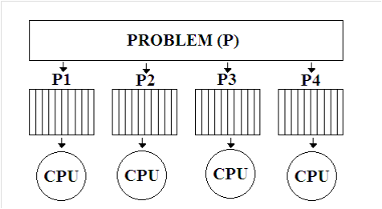

### Paralel Hesaplama

Paralel hesaplamada yapılacak bir iş, birden çok iş bölümlerine ayrılır ve her iş bölümünde bulunan sonuçlar bir yerde toplanır (örneğin, ana bilgisayar) ve bu şekilde, bu işlerin daha kısa zamanda ve daha hızlı bir şekilde yapılmasına olanak sağlanır. Günümüzde, artık çoğu bilgisayarda çift çekirdekli işlemcilerin (hatta dört çekirdeklileri de piyasaya çıkmıştır) kullanılmasıyla paralel hesaplamayla yapılabilecek projelere yeni alanlar açılmış ve bu sayede paralel hesaplama üzerindeki ilgi daha da artmıştır.  Paralel hesaplama ile sonuca daha hızlı ulaşmanın yanında iş bölümleri aynı anda işletilerek eş zamanlı olarak da işlemlerin yapılmasıyla performans da arttırılır. Çift ve çok çekirdekli işlemciler ile artık, bilgisayarların, işlemleri daha hızlı ve kısa sürede yapabilmeleri, hatta daha az ısınmaları da sağlanabilmektedir. Paralel hesaplamaları gerçekleştirmek için ya istemci-sunucu (client-server) tarzı bir yaklaşım ya da paralel hesaplama için geliştirilmiş özel yöntem ve programlar, örneğin Mpich2 kullanılabilir.

### Paralel Hesaplama Nedir?

Paralel hesaplama, aynı görevin (parçalara bölünmüş ve uyarlanmış halinin), sonuçları daha hızlı elde etmek için çoklu işlemcilerde eş zamanlı olarak işletilmesidir. Bu fikir, problemlerin çözümünün ufak görev parçalarına bölünmesi ve bunların eş zamanlı olarak koordine edilmesine dayanır.

Paralel hesaplamayla bir problemin;
  
  1)	Birden çok parçaya ayrılması sağlanır.
  2)	Bu parçalar eşit zaman aralıklarına bölünür.
  3)	Her bir iş bölümü farklı CPU’larda eş zamanlı olarak işleme alınır, hesaplama yapılır.

Bir problemin eş parçalara ayrılarak eş zamanlı olarak farklı CPU’larda çalıştırılması: 

### Neden Paralel Hesaplama? 
•	Bellek kullanımını en uygun şekilde gerçekleştirerek bilgisayardaki yavaşlamaları engellemesi, 

•	Tek CPU’nun yerine çoklu (çift,dört, vs.) CPU kullanılması ile sıcaklık artışının engellenmesi, 

•	Hesaplamaların hızlı bir şekilde yapılmasını sağlama. 

•	Hızlı hesaplama ile performans artışı.

•	Zaman ve para kazancı: Teorik olarak, bir göreve daha fazla kaynak atamak o işin yapım süresini kısaltır. Bir işi seri bir şekilde yapacak bir işlemci aynı işi paralel ve aynı sürede yapacak işlemciden çok daha pahalıdır.

•	Yerel olmayan kaynakların kullanımı:  Yerel hesaplama kaynakları yetersiz olduğunda, farklı makinaların kaynaklarını kullanmak için. Örneğin; SETI@home, Climateprediction.net, Rosetta@home, World Community Grid.

•	Büyük ve karmaşık işlemleri çözümlemek: Birçok problem çok büyük veya karmaşıktır. Örneğin; web arama motorları, sosyal medya veritabanları, her saniyede milyonlarca sorguyu işlemektedir. Bu problemleri sınırlı bir hafızada çözmek pratik değildir ya da imkansızdır.

